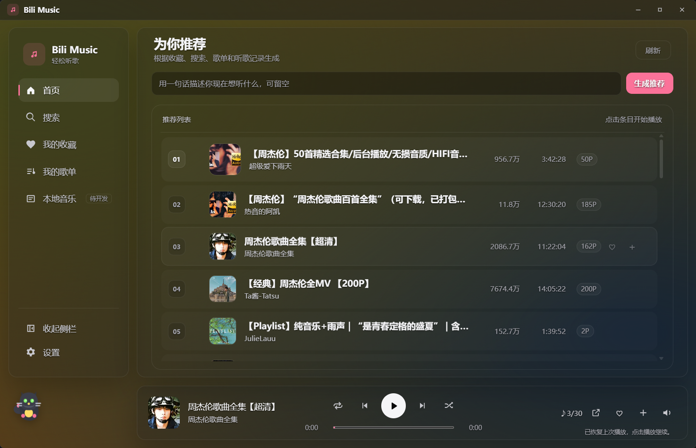
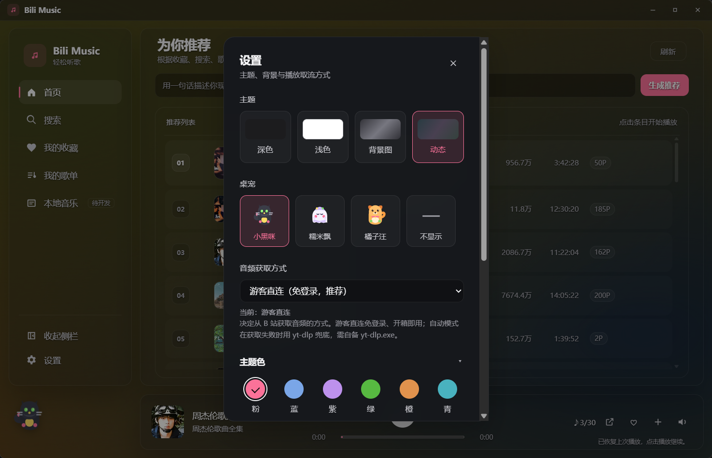

<div align="center">
  

  <h1>Bili Music · 午夜黑胶</h1>

  <p>一个免登录、不落盘的 B 站音乐播放器。把哔哩哔哩当作你的曲库，听歌不必登录，不必下载。</p>
</div>

<div>
  
  
  
</div>

---

> ⚠️ **非官方项目**：本项目与哔哩哔哩（bilibili）没有任何官方关联或背书，仅供个人学习与研究使用。详见文末 [法律声明](#法律声明与使用限制)。

## ✨ 这是什么

Bili Music 是一个基于 **Tauri v2 + Rust** 的桌面音乐播放器，把 B 站音乐区当作曲库来听歌。它和市面上同类工具最大的不同，在于两条贯穿始终的设计原则：

- 🔒 **免登录**：默认走游客身份取流与搜索，全程不需要账号 `cookie`，没有封号顾虑。
- 💧 **不落盘**：音频通过本地流代理在线播放，不下载，不缓存到磁盘，听完即走。

换句话说，它刻意没有走“登录账号 + 下载到本地”那条更省事、但更有风险的路，而是把“零负担、零配置、隐私友好”作为产品核心。

## 🎧 核心特性

| 功能 | 说明 |
| --- | --- |
| 🔎 音乐搜索 | B 站音乐区搜索，本地相关性重排让原曲上浮，可按「单曲 / 合集」筛选，支持粘贴 BV 号直接播放 |放 |
| 🏠 首页为你推荐 | 首页聚焦「为你推荐」：基于收藏 / 歌单 / 听歌记录，由 AI 生成检索意图再重排真实结果 |
| 🧠 一句话推荐 | 复用你自己的 AI Key，一句「想听点安静的钢琴」即可即时引导本次推荐方向 |
| 🕑 听歌记录 | 本地记录真正听过的歌（长歌够 30s、短歌听完 90% 才算），持续加厚推荐口味 |
| 🐾 桌宠陪伴 | 侧边栏桌宠（小黑咪 / 糯米飘 / 橘子汪），会律动、切歌收藏时冒气泡，只对可观测事件反应 |
| 💾 数据备份 | 一键把收藏、歌单、听歌记录、AI 配置与背景图导出成 zip，换机或重装一键导回 |
| 🎵 在线流式播放 | 后端 Axum 流代理，透传 `Range`，边下边播，不落盘 |
| 📼 合集连播 | 多 P 视频可自动顺序连播，标题跟随当前分 P 切换 |
| ❤️ 收藏与歌单 | 本地 JSON 持久化收藏与自建歌单，原子写入，坏文件不覆盖 |
| 🪞 沉浸播放页 | 大封面、滚动歌词、上下渐隐，与底部播放条共享同一套播放器状态 |
| 🌘 四档主题 | 深色 / 浅色 / 背景图 / 动态背景，动态主题从当前封面取色生成流动渐变；另可在六种主题色中自选 |
| 🪟 原生质感 | 自定义无边框标题栏，整体更像桌面应用而不是浏览器壳 |
| 🎤 自动歌词 | 播放时自动识别歌曲并显示滚动歌词，支持 ±0.5s 校准、手动匹配与全文浏览 |
| 📥 收藏夹导入 | 粘贴 B 站公开收藏夹链接，一键批量导入为本地歌单，自动跳过失效条目 |
| ↕️ 拖拽排序 | 歌单、歌单内歌曲、收藏均可拖动调整顺序 |
| 🪟 任务栏控制 | Windows 悬停任务栏图标即可上一首 / 播放暂停 / 下一首 |
| 📐 侧栏可调 | 拖拽调节侧栏宽度，可折叠为纯图标模式，状态自动记住 |

## 🧠 技术亮点

> 这一节写给技术读者：项目里几个有意思的工程决策与难点。

### 1. 免登录游客取流

常见方案是登录账号，再用 `yt-dlp --cookies` 解析下载。本项目改成 **游客身份** 直接领取 `buvid` 票据，经 WBI 签名请求 `playurl` 拿到音频直链，全程不依赖登录态。

性能上也明显更快：

| 方案 | 首播耗时 |
| --- | --- |
| `yt-dlp`（旧方案，需 cookie） | ~12.79s |
| 游客直链（冷启动） | ~1.83s |
| 游客直链（热态） | ~0.54s - 0.91s |

`yt-dlp` 仍作为 **可选兜底** 保留，只在极少数游客取流失败时启用；默认分发版本不包含它，保持“双击即用”。

### 2. 真实风控场景下的游客搜索

无 `cookie` 首次搜索时，曾遇到返回 `v_voucher` 而不是正常数据。最终定位到根因是游客身份只拿到了 `buvid3`、缺了 `buvid4`。修复策略不是“强行上登录态”，而是把游客身份补领逻辑改成“缺任一项都走 SPI 补齐”。

这类问题没有现成模板，价值就在于把真实风控行为摸清、再最小代价地兼容掉。

### 3. 搜索展示与播放队列解耦

早期有个很烦的行为：一搜索，就会打断当前播放。根因是“搜索结果列表”和“真实播放队列”绑死了。

现在拆成两套状态：

- `searchState.results`：只负责右侧展示。
- `playerState.queue`：只负责真实播放。

结果是：搜索只更新展示；只有点中某首歌时，才把当前展示列表升级成播放队列。这个解耦也顺带让首页榜单、收藏、歌单都能复用同一套播放状态机。

### 4. 切歌不串台

快速切歌时，旧请求可能在新请求之后才返回，污染当前播放。这里用了 `requestVersion` 作为请求代号，并在登记代理 URL 前再做一次当前任务身份校验，确保迟到的旧结果一律作废。

这样既能避免串台，也能正确区分“真实解析失败”和“用户主动切歌取消”。

### 5. 多 P 合集的最小侵入接入

B 站大量音乐资源本质上是多 P 合集。项目没有去推翻既有按 `BV` 组织的播放队列，而是旁挂分 P 游标和显示层快照，让“当前播放推进”和“当前标题显示”理解分 P 的存在即可。

这保证了多 P 连播能接进来，同时不破坏已经稳定的队列、随机、循环、失败跳过逻辑。

### 6. 本地数据原子写入

收藏、歌单、搜索历史都落在本地 JSON。写入走原子方案：临时文件、备份、再重命名，并处理 Windows 下重命名不能直接覆盖现有文件的细节。读取时如果文件损坏，会显式报错，但绝不会拿空数据覆盖掉坏文件。

### 7. 零幻觉的 AI 口味推荐

推荐链路刻意约束成「LLM 只出意图、不出结果」：模型基于你的搜索历史、收藏、歌单、听歌记录（以及可选的一句话）只负责 **生成检索关键词意图** 与 **对真实候选重排**；每一个最终出现的 `bvid` 都必须来自真实 `search_videos` 返回、逐个校验，模型无法编造任何一首不存在的歌——这条不变量由回归测试焊死。

结果是「听得越多、推得越准」，同时从架构上杜绝了大模型凭空捏造资源的风险。

### 8. 搜索结果的本地相关性重排

B 站搜索的 `totalrank` 排序优化的是点击率，对播放器来说结果并不理想：搜一首歌，几小时长的合集和二创会靠热度压过原曲。

项目在拿到结果后做一层本地重排，四项加权打分：关键词覆盖率（主信号）、时长合理性（单曲加分、超长合集降权）、精确短语命中、以及 B 站原始位次（弱先验）。

有两个细节值得一提：一是覆盖率用的是 `|K∩T| / |K|` 而非 Dice 系数——后者分母含标题长度，会误杀「【Hi-Res无损音质】吴昊《此去半生》…」这类带长前缀的精确匹配；二是重排开关由调用方显式传入，而不是从排序参数反推，避免以后新增排序选项时静默失效。

整套打分是纯逻辑，带完整单测。

## 🔧 技术栈

- **框架**： [Tauri v2](https://tauri.app/)
- **后端**：Rust + Cargo workspace + Axum 本地流代理
- **前端**：原生 HTML / CSS / JavaScript
- **取流**：游客直链为主，[yt-dlp](https://github.com/yt-dlp/yt-dlp) 可选兜底
- **本地数据**：JSON（收藏、歌单、搜索历史）

> **致谢**
> - B 站接口整理参考了 [SocialSisterYi/bilibili-API-collect](https://github.com/SocialSisterYi/bilibili-API-collect)
> - 歌词数据由第三方接口 [落月 API](https://doc.vkeys.cn/) 提供
## 📦 安装与运行

> ⚠️ **平台说明**：主要在 **Windows 10 / 11** 上开发与验证；**macOS** 由协作者 [@liyu-1028](https://github.com/liyu-1028) 适配与测试，提供 Apple Silicon 与 Intel 两个版本。Linux 理论上 Tauri 可支持，但**未经测试**。

### 方式一：直接下载使用

前往 [Releases](https://github.com/Jmiao11/bili-music/releases) 下载对应平台的安装包：

- **Windows**：下载 zip，解压后运行文件夹内的 `bili-music.exe`
- **macOS**：Apple Silicon 下载 `arm64.dmg`，Intel 下载 `x64.dmg`。首次打开若提示「无法验证开发者」，在 Finder 中右键 App → 打开 → 再点「打开」

- 免安装、免登录，默认纯游客模式，无需任何配置。
- 统一保存在系统用户目录（Windows：`%APPDATA%\bili-music\`；macOS：`~/Library/Application Support/bili-music/`），运行时不会在程序目录留下任何文件

### 方式二：从源码构建

#### 1. 前置依赖

| 依赖 | 说明 |
| --- | --- |
| [Rust](https://www.rust-lang.org/tools/install) | Edition `2021` |
| [Node.js](https://nodejs.org/) | 用于本地 Tauri 开发环境，建议 LTS |
| [Tauri CLI](https://tauri.app/) | `cargo install tauri-cli` |
| WebView2 Runtime | Windows 10/11 通常已自带；缺失时从微软官网安装 |

#### 2. 克隆并运行

```bash
git clone https://github.com/Jmiao11/bili-music.git
cd bili-music

# 开发模式
cargo tauri dev

# 构建免安装 exe
cargo tauri build
```

构建产物位于 `target/release/`。

#### 3. 可选：启用 `yt-dlp` 兜底

默认游客模式已经能正常使用。若希望在极少数游客取流失败时保留兜底：

1. 下载 [`yt-dlp.exe`](https://github.com/yt-dlp/yt-dlp/releases)，放到 exe 同目录；开发模式下放到项目根的 `tools/yt-dlp.exe`。
2. 如该兜底需要 `cookie`，将 `cookies.txt`（Netscape 格式）放到同一目录。

> 🔒 `cookies.txt` 含登录态，已被 `.gitignore` 忽略，请勿提交。`yt-dlp` 兜底只用于覆盖极个别游客无法取流的视频，并非必需。


## ⚖️ 法律声明与使用限制

- 本项目为**非官方**第三方客户端，与哔哩哔哩（bilibili）无任何官方关联或背书，不使用其商标与标识；相关名称与商标归各自权利人所有。
- 本项目**仅供个人学习与研究使用**，**禁止任何形式的商业用途**，包括但不限于销售、收费服务、广告变现、商业集成等。
- 本项目**不下载、不存储**任何音视频内容到磁盘，仅做在线播放；不绕过登录 / 会员权限，不破解任何 DRM 或加密措施。
- 数据来源于公开接口；使用时须遵守哔哩哔哩的《用户协议》《社区规则》及相关法律法规，不得用于批量爬取、恶意抓取等违反平台规则的行为。
- 使用本项目所产生的一切风险与责任由使用者自行承担；如权利人认为项目存在侵权或合规问题，请通过 Issue 联系，我会及时处理。

## 许可

本项目采用 [MIT License](LICENSE)。

本项目为非官方的第三方客户端，与 bilibili 无关，仅供学习研究。使用者需自行遵守 B站 及相关第三方接口的服务条款。

<div align="center">
  <sub>由 Tauri + Rust 构建 · 仅供学习研究 · 如果这个项目对你有帮助，欢迎 Star</sub>
</div>
